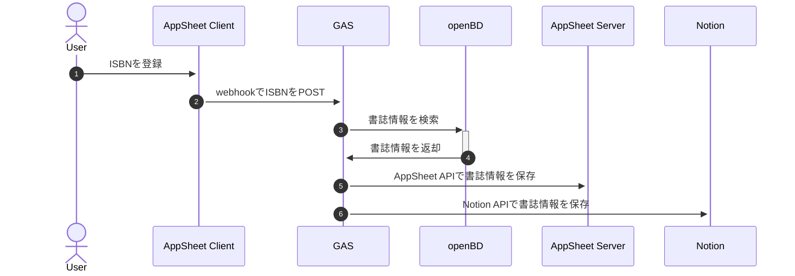

# isbn2notion

ISBNから書誌情報を取得し、Notionのデータベースに挿入するスクリプト。

https://user-images.githubusercontent.com/11168451/156522570-be7541e1-8c58-4b5c-84b2-a1af06ccd197.mp4

## シーケンス図

## 環境変数設定

1. `env.ts.example`を`env.ts`にリネームして、各項目を記載しておく
1. `$ clasp push` を実行する。手元のscriptで`script.google.com`の内容が上書きされる
1. GASエディタ上の`config.gs`で`setProperties`を実行する。`scriptProperties`として各項目が設定される