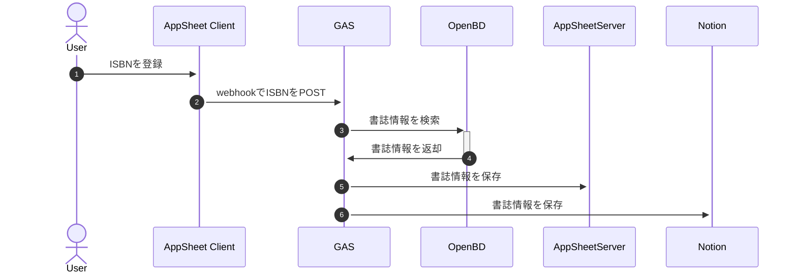

# isbn2notion

ISBNから書誌情報を取得し、Notionのデータベースに挿入するスクリプト。

## シーケンス図

## 環境変数設定

1. `env.ts.example`を`env.ts`にリネームして、各項目を記載しておく
1. `$ clasp push` を実行する。手元のscriptで`script.google.com`の内容を上書きされる
1. GASエディタ上のconfig.gsでsetPropertiesを実行する。scriptPropertiesとして各項目が設定される